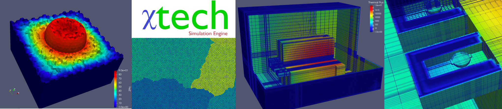

  

# Chi-Tech #

Chi-tech is a large-scale scientific simulation engine being developed at 
Texas A&M University as part of a research study on massively parallel 
algorithms for modeling and simulation. Currently, the main physics modules 
of Chi-Tech deal with solving the linear Boltzmann equation and 
diffusion-reaction physics.

Please visit the links below where you will find:

- [Compilation and run instructions](ChiDoc/Start_install.md)
- [Source code documentation](ChiDoc/Start_source_code_doc.md)
- [User Tutorials](ChiDoc/Start_user_tutorials.md)
- [Developer Tutorials](ChiDoc/Start_developer_tutorials.md)
- [Simulation Gallery](ChiDoc/Gallery.md)

For help, please post on our [Discussions](https://github.com/chi-tech/chi-tech/discussions) page.
