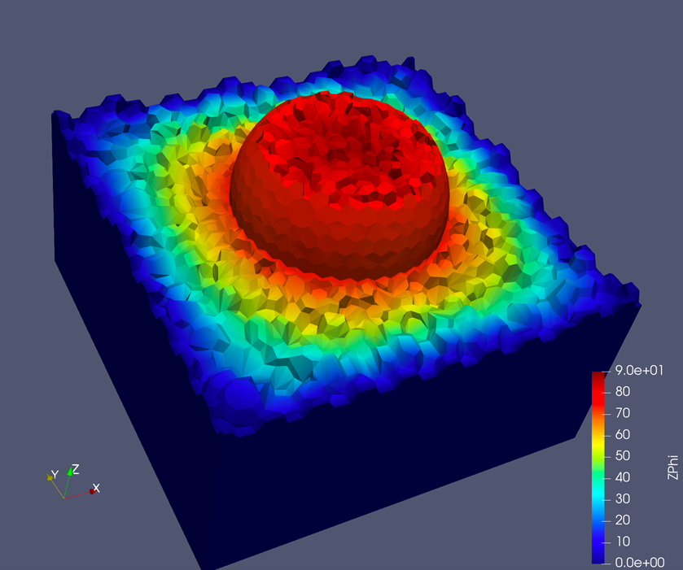
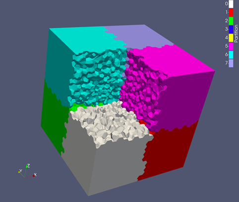
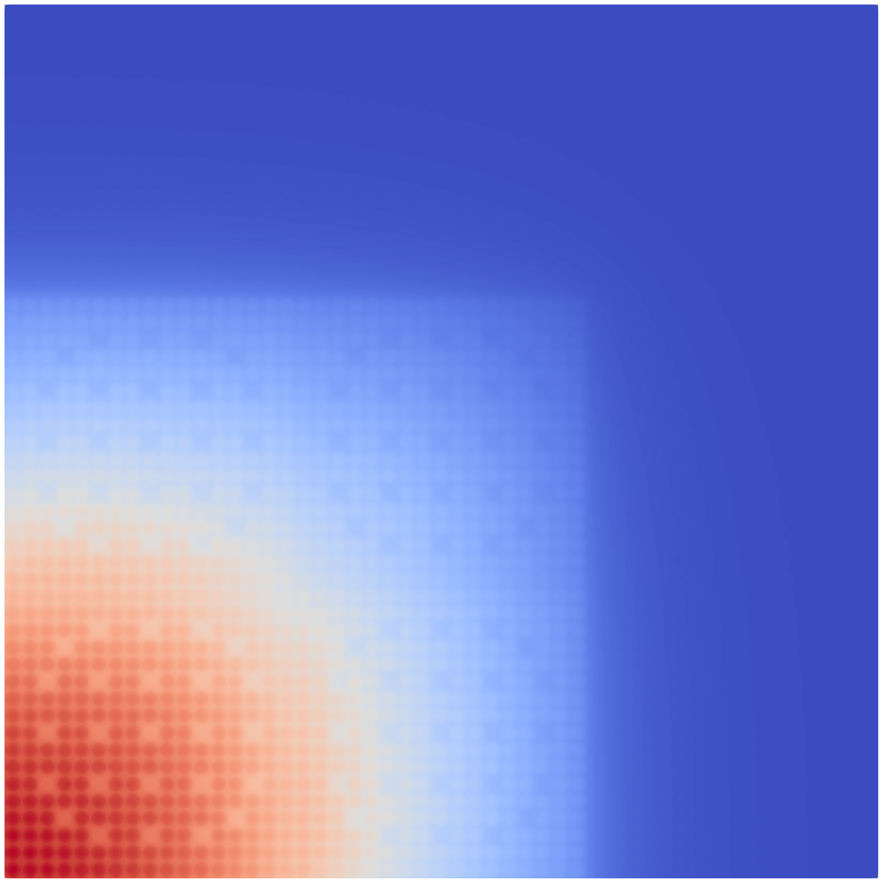
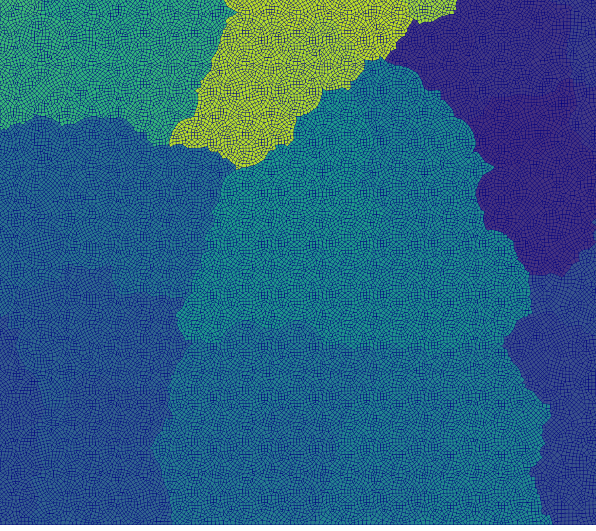

# Chi-Tech #

A large-scale scientific simulation engine being developed at Texas A&M University 
as part of a research study.

Chat with us on <a href="https://discord.gg/AJHHeAA">Discord</a>

## Installation instructions

We have a set of easy instructions for users running Ubuntu 18.04+ (including WSL
with Ubuntu 18.04, as well as newer Ubuntu LTS)

Easy scripts - [Easy Linux instructions](ChiDoc/Install_ubuntu_easy.md)

If the automated installation of dependencies fails, or if you don't have a system
supporting it, then follow the instructions below: 

For Linux machines - [Linux installation instructions](ChiDoc/Install_linux.md)  
For MacOS machines - [MacOS installation instructions](ChiDoc/Install_macos.md)

## Documentation

The preferred method of accessing the documentation is to clone the repo and
build the doxygen-based documentation. However the documentation
is also periodically updated at the following link:

[Online Documentation](https://chi-tech.github.io)

# Showcase
## 1. Capable of sweeps on Polyhedral meshes
Sphere embedded within a box:
- Concave cells induce cyclic dependencies between cells.
- Non-cutting Volumetric partitioning induces cyclic dependencies
  between processors.
- Data structures allows for sweeping will all forms of cycles.

3D Polyhedral mesh generated with STAR-CCM+.

Slice of the solution.

Arbitrary, non-cutting, KBA-style partitioning used.

## 2. C5G7 Criticality Benchmark with 768 processors
The famous reactor benchmark C5G7:
- 7 energy groups
- 200 directions
- 454,491 cells
- Ran on 768 processors
- Took only 18 minutes to complete
- Used 584 GB of memory
- `k_eff` within 100 pcm

Closeup view of the mesh used. Colors represent materials.

Energy group 0 solution.

Energy group 6 solution.

ParMETIS partitioning of the mesh (768 processors).

Closeup of the ParMETIS partitioning with the mesh visible.

## 2. Real world simulations
Center for Exascale Radiation Transport (CERT) simulated, and
compared to experiment, a graphite pile with a high energy neutron
source. This simulation used:
- ~172 energy groups. 
- over 3000 directions. 
- ~500k cells.
- Over 100k processors for some simulations.

